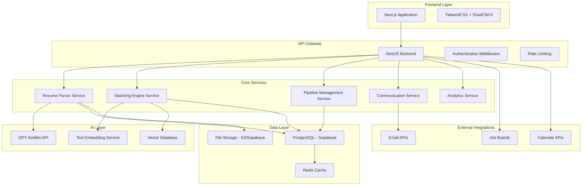

# Design Document

## Overview

The AI-native ATS is designed as a modern, scalable web application that leverages AI for resume parsing, candidate matching, and process automation. The system follows a microservices-inspired architecture with clear separation between frontend, backend API, AI services, and data storage layers.

The core innovation lies in the Job Posting Variation Model, which allows efficient management of similar roles across multiple companies without duplication, and the Explainable AI Matching system that provides transparent, bias-free candidate scoring.

## Architecture

### High-Level Architecture



### Technology Stack Details

**Frontend:**

- Next.js 14 with App Router for server-side rendering and optimal performance
- TailwindCSS for utility-first styling
- ShadCN/UI for consistent, accessible component library
- React Hook Form for form management
- Zustand for client-side state management

**Backend:**

- NestJS framework for scalable Node.js architecture
- PostgreSQL via Supabase for primary data storage
- Redis for caching and session management
- JWT-based authentication with role-based access control

**AI Integration:**

- OpenAI GPT-4o for resume parsing and explanation generation
- OpenAI GPT-4o Mini for cost-effective text processing
- text-embedding-3-large for semantic similarity matching
- Pinecone or pgvector for vector storage and similarity search

## Components and Interfaces

### 1. Job Posting Variation Model

#### Core Entities

**JobFamily**

```typescript
interface JobFamily {
  id: string;
  name: string; // e.g., "Software Engineer"
  description: string;
  baseRequirements: RequirementItem[];
  skillCategories: string[];
  createdAt: Date;
  updatedAt: Date;
}
```

**JobTemplate**

```typescript
interface JobTemplate {
  id: string;
  jobFamilyId: string;
  name: string; // e.g., "Senior Software Engineer"
  level: "junior" | "mid" | "senior" | "lead" | "principal";
  baseRequirements: RequirementItem[];
  experienceRange: { min: number; max: number };
  salaryRange?: { min: number; max: number; currency: string };
  createdAt: Date;
  updatedAt: Date;
}
```

**CompanyProfile**

```typescript
interface CompanyProfile {
  id: string;
  name: string;
  industry: string;
  size: "startup" | "small" | "medium" | "large" | "enterprise";
  culture: string[];
  benefits: string[];
  workArrangement: "remote" | "hybrid" | "onsite";
  location: string;
  preferences: {
    prioritySkills: string[];
    dealBreakers: string[];
    niceToHave: string[];
  };
  createdAt: Date;
  updatedAt: Date;
}
```

**CompanyJobVariant**

```typescript
interface CompanyJobVariant {
  id: string;
  jobTemplateId: string;
  companyProfileId: string;
  customTitle?: string;
  additionalRequirements: RequirementItem[];
  modifiedRequirements: RequirementItem[];
  customDescription?: string;
  isActive: boolean;
  publishedAt?: Date;
  createdAt: Date;
  updatedAt: Date;
}
```

**RequirementItem**

```typescript
interface RequirementItem {
  id: string;
  type: "skill" | "experience" | "education" | "certification" | "other";
  category: "must" | "should" | "nice";
  description: string;
  weight: number; // 1-10 for matching algorithm
  alternatives?: string[]; // Alternative ways to satisfy this requirement
}
```

**JDVersion (Job Description Version)**

```typescript
interface JDVersion {
  id: string;
  companyJobVariantId: string;
  version: number;
  resolvedSpec: ResolvedJobSpec;
  publishedContent: string; // Final job description for posting
  createdBy: string;
  createdAt: Date;
}
```

**ResolvedJobSpec**

```typescript
interface ResolvedJobSpec {
  title: string;
  description: string;
  requirements: RequirementItem[];
  company: CompanyProfile;
  salaryRange?: { min: number; max: number; currency: string };
  benefits: string[];
  workArrangement: string;
  location: string;
}
```

### 2. Candidate Management System

**Candidate**

```typescript
interface Candidate {
  id: string;
  email: string;
  firstName: string;
  lastName: string;
  phone?: string;
  location?: string;
  linkedinUrl?: string;
  portfolioUrl?: string;
  resumeUrl?: string;
  parsedData: ParsedResumeData;
  skillEmbeddings: number[]; // Vector representation of skills
  createdAt: Date;
  updatedAt: Date;
  consentGiven: boolean;
  consentDate?: Date;
}
```

**ParsedResumeData**

```typescript
interface ParsedResumeData {
  skills: Skill[];
  experience: WorkExperience[];
  education: Education[];
  certifications: Certification[];
  summary?: string;
  totalExperience: number; // in years
}
```

**Application**

```typescript
interface Application {
  id: string;
  candidateId: string;
  companyJobVariantId: string;
  status: PipelineStage;
  fitScore: number; // 0-100
  matchExplanation: MatchExplanation;
  appliedAt: Date;
  lastUpdated: Date;
  notes: ApplicationNote[];
  stageHistory: StageHistoryEntry[];
}
```

### 3. AI Matching Engine

**MatchExplanation**

```typescript
interface MatchExplanation {
  overallScore: number;
  breakdown: {
    mustHaveScore: number;
    shouldHaveScore: number;
    niceToHaveScore: number;
  };
  strengths: string[];
  gaps: string[];
  recommendations: string[];
  detailedAnalysis: RequirementMatch[];
}
```

**RequirementMatch**

```typescript
interface RequirementMatch {
  requirement: RequirementItem;
  matched: boolean;
  confidence: number; // 0-1
  evidence: string[]; // What in the resume supports this match
  explanation: string;
}
```

### 4. Pipeline Management

**PipelineStage**

```typescript
type PipelineStage =
  | "applied"
  | "screening"
  | "shortlisted"
  | "interview_scheduled"
  | "interview_completed"
  | "offer_extended"
  | "offer_accepted"
  | "hired"
  | "rejected";
```

**StageHistoryEntry**

```typescript
interface StageHistoryEntry {
  id: string;
  applicationId: string;
  fromStage?: PipelineStage;
  toStage: PipelineStage;
  changedBy: string;
  changedAt: Date;
  notes?: string;
  automated: boolean;
}
```

## Data Models

### Database Schema Design

The system uses PostgreSQL with the following key tables:

1. **Users & Authentication**

   - users (id, email, role, company_id, created_at, updated_at)
   - user_sessions (session management)

2. **Job Management**

   - job_families
   - job_templates
   - company_profiles
   - company_job_variants
   - requirement_items
   - jd_versions

3. **Candidate Management**

   - candidates
   - parsed_resume_data
   - applications
   - application_notes
   - stage_history

4. **AI & Matching**

   - skill_embeddings (vector storage if not using pgvector)
   - match_explanations
   - requirement_matches

5. **Communication**

   - email_templates
   - email_logs
   - communication_history

6. **Analytics**
   - pipeline_metrics
   - source_performance
   - diversity_metrics

### Vector Storage Strategy

For semantic matching, the system will use:

- **Primary Option**: pgvector extension in PostgreSQL for vector storage
- **Alternative**: Pinecone for dedicated vector database if scaling requirements exceed PostgreSQL capabilities

Skills and job requirements will be embedded using OpenAI's text-embedding-3-large model and stored as vectors for similarity matching.

## Error Handling

### Error Categories

1. **Validation Errors**: Input validation failures, schema violations
2. **AI Service Errors**: OpenAI API failures, rate limiting, parsing errors
3. **Database Errors**: Connection issues, constraint violations, transaction failures
4. **Integration Errors**: Email service failures, job board API errors
5. **Authentication Errors**: Invalid tokens, insufficient permissions
6. **File Processing Errors**: Resume parsing failures, file corruption

### Error Handling Strategy

```typescript
interface APIError {
  code: string;
  message: string;
  details?: any;
  timestamp: Date;
  requestId: string;
}

// Error response format
interface ErrorResponse {
  success: false;
  error: APIError;
  retryable: boolean;
}
```

**Error Handling Patterns:**

- Graceful degradation for AI service failures
- Retry logic with exponential backoff for transient failures
- Circuit breaker pattern for external service integration
- Comprehensive logging for debugging and monitoring
- User-friendly error messages with actionable guidance

## Testing Strategy

### Testing Pyramid

1. **Unit Tests (70%)**

   - Service layer logic
   - Utility functions
   - Data transformation
   - Validation logic

2. **Integration Tests (20%)**

   - API endpoint testing
   - Database operations
   - External service mocking
   - AI service integration

3. **End-to-End Tests (10%)**
   - Critical user journeys
   - Complete application workflows
   - Cross-browser compatibility

### Testing Tools

- **Backend**: Jest, Supertest for API testing
- **Frontend**: Jest, React Testing Library, Playwright for E2E
- **Database**: Test containers for isolated database testing
- **AI Services**: Mock responses for consistent testing

### Test Data Strategy

- Synthetic candidate data for testing matching algorithms
- Anonymized real resume samples for parsing validation
- Seed data for different company profiles and job templates
- Performance test data sets for load testing

### Continuous Testing

- Pre-commit hooks for unit tests
- CI/CD pipeline with full test suite
- Automated regression testing on staging
- Performance monitoring in production

## Security Considerations

### Data Protection

1. **Encryption**

   - TLS 1.3 for data in transit
   - AES-256 encryption for sensitive data at rest
   - Encrypted database connections

2. **Access Control**

   - JWT-based authentication with refresh tokens
   - Role-based access control (RBAC)
   - API rate limiting and throttling
   - IP whitelisting for admin functions

3. **Privacy Compliance**
   - GDPR-compliant data handling
   - Consent tracking and management
   - Right to be forgotten implementation
   - Data minimization principles

### API Security

- Input validation and sanitization
- SQL injection prevention through parameterized queries
- XSS protection with Content Security Policy
- CORS configuration for frontend integration
- API versioning for backward compatibility

## Performance Optimization

### Caching Strategy

1. **Application Level**

   - Redis for session management
   - Query result caching for frequently accessed data
   - API response caching with appropriate TTL

2. **Database Level**

   - Proper indexing strategy
   - Query optimization
   - Connection pooling
   - Read replicas for analytics queries

3. **Frontend Level**
   - Next.js static generation where appropriate
   - Image optimization
   - Code splitting and lazy loading
   - CDN for static assets

### Scalability Considerations

- Horizontal scaling capability for API servers
- Database sharding strategy for large datasets
- Asynchronous processing for heavy operations (resume parsing, matching)
- Queue system for background jobs (Bull/BullMQ with Redis)

## Monitoring and Observability

### Metrics Collection

- Application performance metrics (response times, throughput)
- Business metrics (applications processed, match accuracy)
- Infrastructure metrics (CPU, memory, database performance)
- AI service usage and costs

### Logging Strategy

- Structured logging with correlation IDs
- Centralized log aggregation
- Error tracking and alerting
- Audit logs for compliance

### Health Checks

- API endpoint health checks
- Database connectivity monitoring
- External service dependency checks
- AI service availability monitoring
