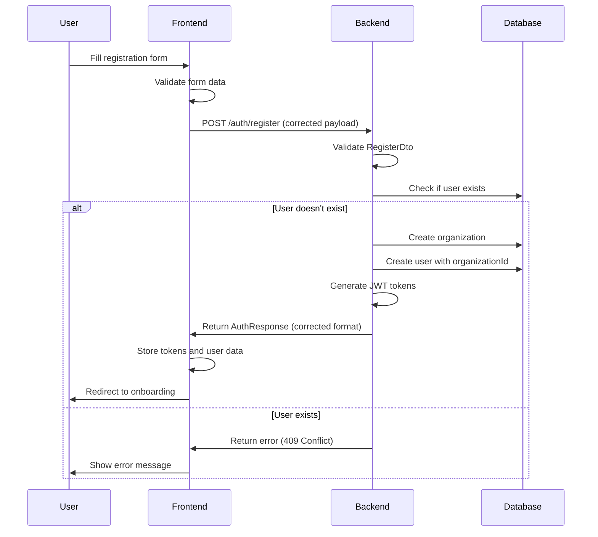

# Authentication System Fixes - Design Document

## Overview

This design document outlines the technical approach to fix the critical authentication issues in the AI-Native ATS platform. The fixes will ensure proper registration flow, data consistency, error handling, and user experience.

## Architecture

### Current Issues Identified

1. **Data Structure Mismatches**: Frontend and backend expect different field names and structures
2. **Missing API Response Handling**: Backend returns different structure than frontend expects
3. **Organization Creation Logic**: Registration doesn't properly handle organization creation
4. **Token Response Format**: Inconsistent token response structure between frontend and backend
5. **Error Handling**: Poor error propagation and user feedback
6. **Missing UI Components**: Toast notifications and proper loading states

### Fixed Architecture Flow



## Components and Interfaces

### 1. Backend Fixes

#### RegisterDto Enhancement

```typescript
export class RegisterDto {
  @IsEmail()
  email: string;

  @IsString()
  @MinLength(8)
  password: string;

  @IsString()
  @IsNotEmpty()
  firstName: string;

  @IsString()
  @IsNotEmpty()
  lastName: string;

  @IsEnum(["recruiter", "hiring_manager"])
  role: "recruiter" | "hiring_manager";

  @IsString()
  @IsNotEmpty()
  companyName: string; // This will be used as organization name

  @IsOptional()
  @IsString()
  organizationId?: string;
}
```

#### AuthResponse Standardization

```typescript
export interface AuthResponse {
  access_token: string;
  refresh_token: string;
  expires_in: number;
  user: {
    id: string;
    email: string;
    firstName: string;
    lastName: string;
    role: UserRole;
    organizationId: string;
    companyId?: string;
  };
}
```

#### Enhanced Auth Controller

```typescript
@Controller("auth")
export class AuthController {
  @Post("register")
  async register(@Body() registerDto: RegisterDto): Promise<AuthResponse> {
    return this.authService.register(registerDto);
  }

  @Post("login")
  @HttpCode(HttpStatus.OK)
  async login(@Body() loginDto: LoginDto): Promise<AuthResponse> {
    return this.authService.login(loginDto);
  }

  @Post("refresh")
  @HttpCode(HttpStatus.OK)
  async refresh(
    @Body() refreshTokenDto: RefreshTokenDto
  ): Promise<{ access_token: string }> {
    return this.authService.refreshToken(refreshTokenDto.refresh_token);
  }

  @UseGuards(AuthGuard("jwt"))
  @Get("verify")
  async verify(@Request() req: any): Promise<{ user: User }> {
    return { user: req.user };
  }
}
```

### 2. Frontend Fixes

#### Updated Auth Service

```typescript
class AuthService {
  async register(userData: RegisterFormData): Promise<RegisterResponse> {
    const payload = {
      email: userData.email,
      password: userData.password,
      firstName: userData.firstName,
      lastName: userData.lastName,
      role: userData.role,
      companyName: userData.companyName, // Map to backend expected field
    };

    const response = await axios.post(`${this.baseURL}/register`, payload);

    return {
      user: response.data.user,
      accessToken: response.data.access_token,
      refreshToken: response.data.refresh_token,
      expiresIn: response.data.expires_in || 3600,
    };
  }
}
```

#### Enhanced Error Handling

```typescript
export class ApiError extends Error {
  constructor(
    message: string,
    public status: number,
    public code?: string,
    public details?: any
  ) {
    super(message);
    this.name = 'ApiError';
  }
}

// In auth service
catch (error) {
  if (axios.isAxiosError(error)) {
    const status = error.response?.status || 500;
    const message = error.response?.data?.message || 'Registration failed';
    const code = error.response?.data?.code;
    throw new ApiError(message, status, code, error.response?.data);
  }
  throw new Error('An unexpected error occurred');
}
```

#### Toast Notification System

```typescript
// Create missing toast hook
export const useToast = () => {
  const [toasts, setToasts] = useState<Toast[]>([]);

  const toast = useCallback((toast: Omit<Toast, "id">) => {
    const id = Math.random().toString(36).substr(2, 9);
    setToasts((prev) => [...prev, { ...toast, id }]);

    setTimeout(() => {
      setToasts((prev) => prev.filter((t) => t.id !== id));
    }, 5000);
  }, []);

  return { toast, toasts };
};
```

### 3. Database Schema Fixes

#### Organization Creation Logic

```typescript
async register(registerDto: RegisterDto): Promise<AuthResponse> {
  // Create organization first
  const organization = this.organizationRepository.create({
    name: registerDto.companyName,
    type: OrganizationType.SMB,
    subscriptionPlan: SubscriptionPlan.FREE,
  });

  const savedOrganization = await this.organizationRepository.save(organization);

  // Create user with organization reference
  const user = this.userRepository.create({
    email: registerDto.email,
    passwordHash: await bcrypt.hash(registerDto.password, 12),
    firstName: registerDto.firstName,
    lastName: registerDto.lastName,
    role: registerDto.role === 'recruiter' ? UserRole.RECRUITER : UserRole.HIRING_MANAGER,
    organizationId: savedOrganization.id,
    isActive: true,
  });

  const savedUser = await this.userRepository.save(user);

  // Generate tokens
  const payload: JwtPayload = {
    sub: savedUser.id,
    email: savedUser.email,
    role: savedUser.role,
    organizationId: savedUser.organizationId,
  };

  return {
    access_token: this.jwtService.sign(payload),
    refresh_token: this.jwtService.sign(payload, { expiresIn: '7d' }),
    expires_in: 3600,
    user: {
      id: savedUser.id,
      email: savedUser.email,
      firstName: savedUser.firstName,
      lastName: savedUser.lastName,
      role: savedUser.role,
      organizationId: savedUser.organizationId,
    },
  };
}
```

## Data Models

### User Entity Updates

```typescript
@Entity("users")
export class User {
  @PrimaryGeneratedColumn("uuid")
  id: string;

  @Column({ unique: false }) // Remove unique constraint for multi-tenant
  @Index(["email", "organizationId"], { unique: true }) // Composite unique
  email: string;

  @Column()
  passwordHash: string;

  @Column()
  firstName: string;

  @Column()
  lastName: string;

  @Column({
    type: "enum",
    enum: UserRole,
    default: UserRole.RECRUITER,
  })
  role: UserRole;

  @Column("uuid")
  organizationId: string;

  @ManyToOne(() => Organization, { onDelete: "CASCADE" })
  @JoinColumn({ name: "organizationId" })
  organization: Organization;

  @Column({ default: true })
  isActive: boolean;

  @CreateDateColumn()
  createdAt: Date;

  @UpdateDateColumn()
  updatedAt: Date;
}
```

### Organization Entity Updates

```typescript
@Entity("organizations")
export class Organization {
  @PrimaryGeneratedColumn("uuid")
  id: string;

  @Column()
  name: string;

  @Column({
    type: "enum",
    enum: OrganizationType,
    default: OrganizationType.SMB,
  })
  type: OrganizationType;

  @Column({
    type: "enum",
    enum: SubscriptionPlan,
    default: SubscriptionPlan.FREE,
  })
  subscriptionPlan: SubscriptionPlan;

  @OneToMany(() => User, (user) => user.organization)
  users: User[];

  @CreateDateColumn()
  createdAt: Date;

  @UpdateDateColumn()
  updatedAt: Date;
}
```

## Error Handling

### Standardized Error Responses

```typescript
export interface ApiErrorResponse {
  message: string;
  statusCode: number;
  error: string;
  timestamp: string;
  path: string;
  details?: any;
}

// Global exception filter
@Catch()
export class AllExceptionsFilter implements ExceptionFilter {
  catch(exception: unknown, host: ArgumentsHost) {
    const ctx = host.switchToHttp();
    const response = ctx.getResponse<Response>();
    const request = ctx.getRequest<Request>();

    let status = HttpStatus.INTERNAL_SERVER_ERROR;
    let message = "Internal server error";

    if (exception instanceof HttpException) {
      status = exception.getStatus();
      message = exception.message;
    }

    const errorResponse: ApiErrorResponse = {
      statusCode: status,
      timestamp: new Date().toISOString(),
      path: request.url,
      message,
      error: HttpStatus[status],
    };

    response.status(status).json(errorResponse);
  }
}
```

### Frontend Error Handling

```typescript
// Enhanced error handling in auth hook
const register = useCallback(async (userData: RegisterFormData) => {
  setLoading(true);
  try {
    const response = await authService.register(userData);
    // ... success handling
  } catch (error) {
    let message = "Registration failed";

    if (error instanceof ApiError) {
      switch (error.status) {
        case 409:
          message = "An account with this email already exists";
          break;
        case 400:
          message =
            error.details?.message ||
            "Please check your information and try again";
          break;
        case 500:
          message = "Server error. Please try again later";
          break;
        default:
          message = error.message;
      }
    }

    toast({
      title: "Registration Failed",
      description: message,
      variant: "destructive",
    });
    throw error;
  } finally {
    setLoading(false);
  }
}, []);
```

## Testing Strategy

### Unit Tests

- Auth service registration flow
- Token generation and validation
- Organization creation logic
- Error handling scenarios

### Integration Tests

- Complete registration flow
- Login after registration
- Token refresh mechanism
- Multi-tenant user isolation

### E2E Tests

- User registration journey
- Error scenarios (duplicate email, invalid data)
- Cross-browser compatibility
- Mobile responsiveness

## Security Considerations

### Password Security

- Minimum 8 characters with complexity requirements
- Bcrypt with salt rounds of 12
- No password storage in logs or client-side

### Token Security

- JWT with short expiration (1 hour)
- Refresh tokens with longer expiration (7 days)
- Secure HTTP-only cookies for token storage (future enhancement)

### Data Validation

- Server-side validation for all inputs
- SQL injection prevention through TypeORM
- XSS protection through input sanitization

## Performance Considerations

### Database Optimization

- Composite indexes on email + organizationId
- Connection pooling configuration
- Query optimization for user lookups

### Frontend Optimization

- Lazy loading of auth components
- Debounced form validation
- Optimistic UI updates where appropriate

## Deployment Considerations

### Environment Variables

- Separate JWT secrets for different environments
- Database connection strings
- CORS configuration for frontend domains

### Migration Strategy

- Database migrations for schema changes
- Backward compatibility during deployment
- Rollback procedures for failed deployments
